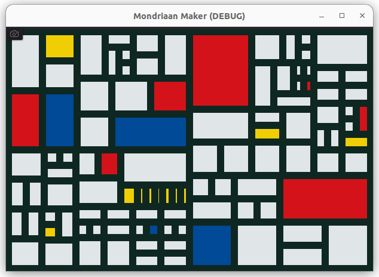

# Mondriaan Maker
Make art in the abstract style of Piet Mondriaan, which is very accesible for childeren and non-artists alike. Practice your artistic eye for ratio's and color 

Example of how to use H/VSplitContainers, Drag & Drop in Godot. Uses Screen Capture addon.

Features:
* 5 Mondrian colors
* click splitting
* color mutations
* drag & drop color to and from rectangles.
* capture
* resizable canvas/window

Palette from: <https://jxapprentice.com/en/art-color-chain-r1-en/>
